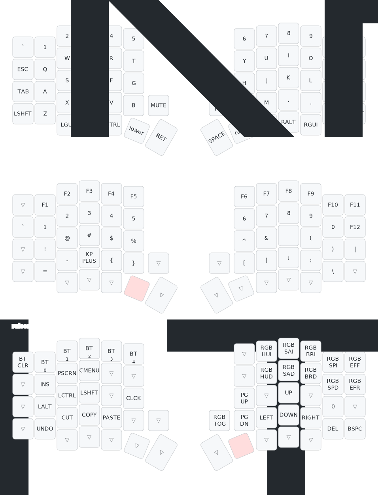

Sean's Sofle Keyboard
=============== 

Happy Birthday, Sean.

This is the repository for your brand new [Sofle](https://github.com/josefadamcik/SofleKeyboard), a split wireless
mechanical keyboard. Your keyboard is a wireless variant of the original Sofle. It is based on the Sofle RGB's design: [SofleChocWireless](https://github.com/josefadamcik/SofleKeyboard)

Key Features:
 * Compatible Kailh Choc V1 low profile switches
 * QWERTY base layout
 * FULLY programable and customizable
 * 3-layer configuratioon
 * OLED Screens
 * Per Key LED Lighting
 * Wireless using a NRF52840
 * 2500mAh battery per keyboard half
 

## Keyboard

This keyboard is designed for low-profile Kailh Choc V1 switches. Choc switches generally have shorter actuation. In short, this allows keys to activate even quicker than the classic MX switches. On top of that, low-profile keys are thought to be more ergonomic. 

The keyboard originally came with [Kailh Choc V1 Red Pro Switches](https://www.littlekeyboards.com/products/kailh-choc-pro-low-profile-switches?variant=32328459681859). These linear switches come in at 35g of actuation force. A lightweight actuation translates to quicker keypresses and even quicker reaction times for gaming. 


## Case
The case is fully custom and self-designed. It comes with a gasket mount for increased comfort and best possible sound.
The STL files for the case can be found within the repository.


## Keymap
If you would like to make changes to the layout, let me know. It's super straightforward and something we can do together. There are MANY features we can add. Some of those are Combos, Tap Dancing, Home Row Mods, Tap-Hold Behavior, and some elaborate Macros. 
More information on what all you can do is here [ZMK Firmware](https://zmk.dev/). 

This is the keyboard's keymap including layer shifts:



## RGB
The keyboard comes with per-key RGB lighting. 
Be aware; that the LEDs use a lot of power and will cause your battery to drain quickly.
For a quick instruction on how hue and saturation work check out this [link](http://www.differencebetween.net/miscellaneous/difference-between-hue-and-saturation/).
In a nutshell, you can change the color by adjusting the hue. 
By decreasing saturation, the colors will become fainter. When saturation is zero, the LEDs are white. At 100% saturation, the LEDs shine in the color specified by the hue setting.

To operate the LEDs follow these instructions:

* Toggle RGB on/off:
  * Enter the 'raised' layer and press the right encoder.

* Hue Increase/Decrease:
  * To increase Hue, enter the 'raised' layer and press '7'.
  * To decrease Hue, enter the 'raised' layer and press 'U'.

* Saturation Increase/Decrease:
  * To increase Saturation, enter the 'raised' layer and press '8'.
  * To decrease Saturation, enter the 'raised' layer and press 'I'.

* Brightness Increase/Decrease:
  * To increase Brightness, enter the 'raised' layer and press '9'.
  * To decrease Brightness, enter the 'raised' layer and press 'O'.

* RGB Effect Speed Increase/Decrease:
  * To increase effect speed, enter the 'raised' layer and press '0'.
  * To decrease effect speed, enter the 'raised' layer and press 'P'.

* RGB Next/Previous Animation:
  * To select the next RBT animation, enter the 'raised' layer and press the top right key on the right keyboard half (above backspace).
  * To select the next RBT animation, enter the 'raised' layer and press 'Backspace'.


## Bluetooth Pairing
The keyboard supports up to 5 devices. Bluetooth configuration is available in the 'raised' layer. 

* Pair device:
  * To pair a device enter the 'raised' layers, and select an unused Bluetooth Profile. Profiles 0 through 4 are available on the '1', '2', '3', '4', and '5' respectively.

* Connect to paired device:
  * If at least one profile is paired, you can connect to the device by entering the 'raised' layer and selecting the corresponding Profile. Profiles 0 through 4 are available on the '1', '2', '3', '4', and '5' respectively.

* Delete paired devices:
  * To delete all Bluetooth profiles enter the 'raised' layer and press the '`'-key.

* Optional - Bluetooth Security:
  * The Bluetooth connection is encrypted, however, with the current configuration of the keyboard, the initial handshake when pairing is unencrypted. If the pairing handshake is captured, it can be used to decrypt all further communication. If you like, I can add a passcode entry to your pairing process to encrypt the pairing process. This adds a step for pairing but increases security.


## Firmware
The firmware can be found and downloaded from the Actions Tab. It will be created automatically whenever any changes are made to this configuration. Unzip the 'firmware' file and you will find one file for the left board and one for the right board.

To flash the firmware, you will need to put the controller into bootloader mode. To do so, connect it to your computer via USB-C, then quickly press the small 'reset' button twice. The controller will then show up as a removable device. Drag and drop the corresponding firmware file onto the controller. You may see an error message as it is copied, ignore the message, the new firmware has been successfully installed. Make sure to flash both halves of the keyboard.


______________________________________________________________________________________________
## Other information


## Keymap image

The keymap image is created using [keymap-drawer](https://github.com/caksoylar/keymap-drawer).
It can be regenerated with the following commands:

```sh
keymap -c img/keymap_drawer.config.yaml parse -c 10 -z config/temper.keymap > img/temper.yaml
keymap -c img/keymap_drawer.config.yaml draw -k chocofi img/temper.yaml > img/temper.svg
```

```sh
defaults write -g ApplePressAndHoldEnabled -bool false
```

## Resources

 * https://github.com/urob/zmk-config
 * https://github.com/caksoylar/keymap-drawer

